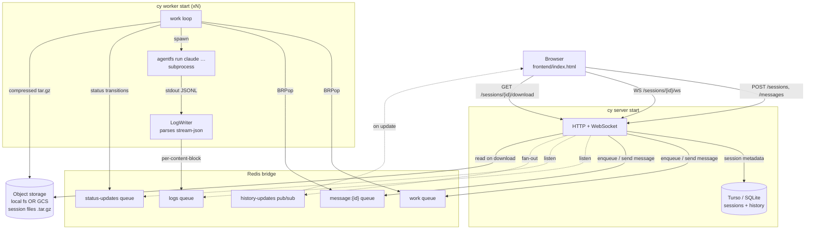
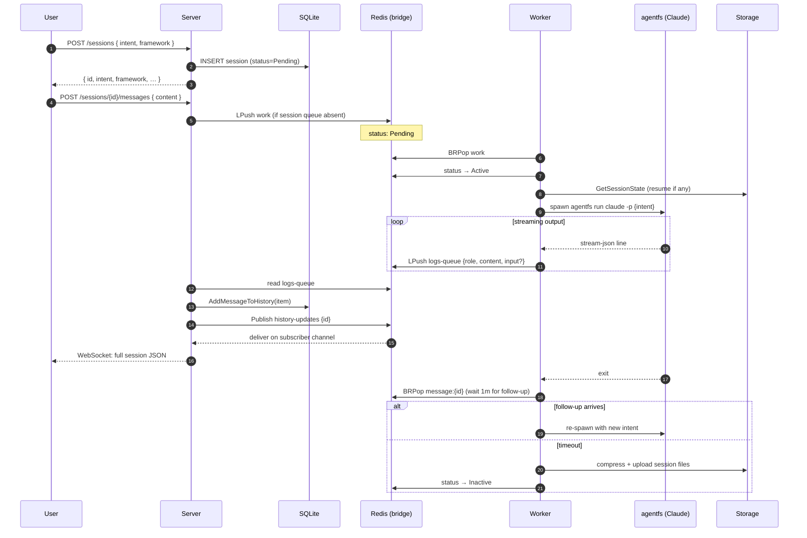
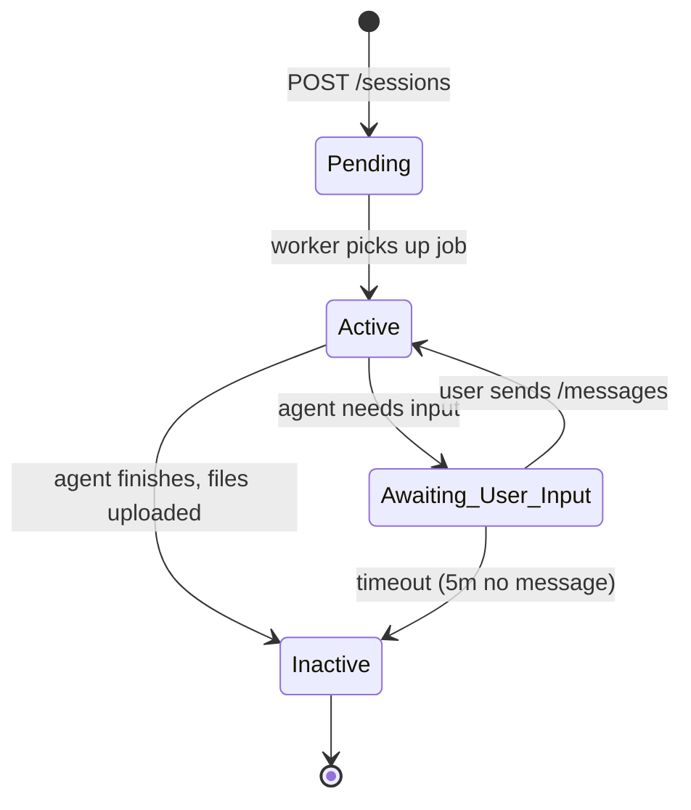
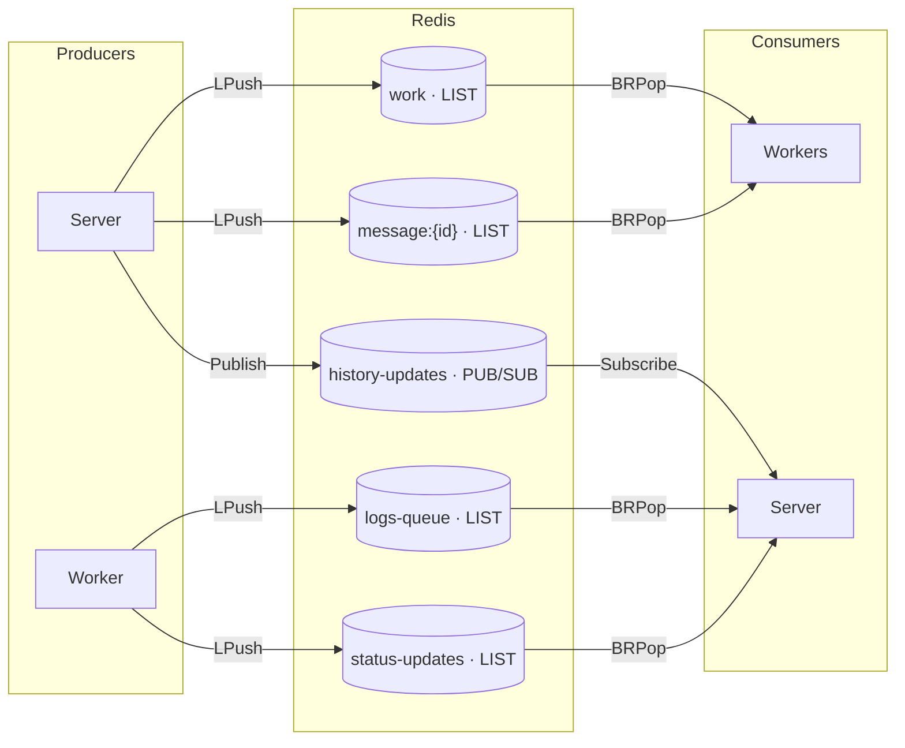
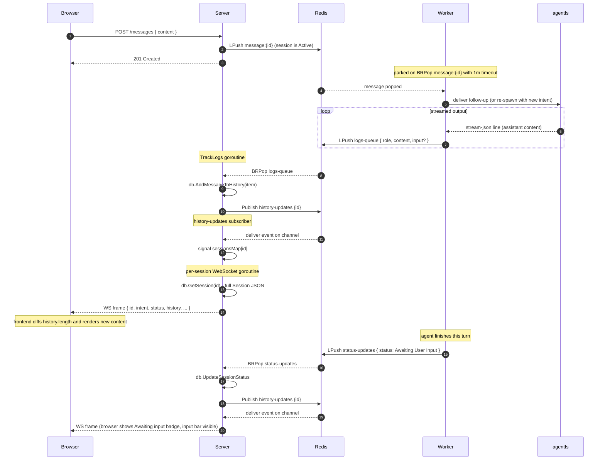

# Chrysalis

A distributed platform for **building AI agents**. You describe an intent — say,
*"a code-review agent that catches missing tests"* — and Chrysalis spins up a
sandboxed worker that uses an agent framework (**Claude Code SDK** or **Google
ADK**) to scaffold, run, and persist a working agent. Output streams to a chat
UI in real time; the generated code is downloadable as a tarball when the run
is done.

```
   ┌──────────────────────────────────────────────────────────────┐
   │                       Chrysalis                              │
   │                                                              │
   │    "build me an agent that …"  →  scaffolded agent project   │
   │                                                              │
   └──────────────────────────────────────────────────────────────┘
```

---

## Quick start

**Prerequisites**

- Go 1.25+
- Redis listening on `localhost:6379` (default — overridable)
- The `agentfs` CLI on `$PATH` (the worker shells out to it to drive Claude Code)
- A Google Cloud bucket (only if you set `--storage-type=gcs`; the default `local` writes to disk)

**Build and run**

```bash
make build                  # → ./bin/cy

# in one terminal
make run-server             # serves API + frontend on :9999

# in another
make run-worker             # picks up jobs from the work queue
```

Then open [http://localhost:9999](http://localhost:9999) and create an agent.

---

## Architecture

Chrysalis is a small set of cooperating processes. The **server** is the only
thing the browser talks to; **workers** are headless and pull jobs from Redis;
all state lives in either SQLite (metadata + history) or object storage (code
files).



**Why two processes?** The server is I/O-bound and must stay responsive to the
browser. The worker shells out to a long-running CPU/I/O-heavy subprocess
(`agentfs`) that produces a streaming JSON output. Decoupling them lets you
scale workers horizontally and survive worker crashes without dropping the UI.

**Why Redis as the bridge?** Five distinct shapes of message: durable work
queue (lists with `BRPop`), per-session message queue, log line queue,
status-update queue, and a fan-out pub/sub channel for history updates. Redis
gives all five with one primitive set and bounded memory.

---

## Lifecycle of a session



### Session status

Status is server-authoritative. The worker writes transitions through Redis;
the server persists them and notifies the browser.



The frontend uses these states to drive UX:

| Status                 | Input visible? | Live badge | Download button |
| ---------------------- | :------------: | :--------: | :-------------: |
| Pending                | hidden         | "Pending"  | —               |
| Active                 | hidden         | "Active"   | —               |
| Awaiting User Input    | shown          | shown      | —               |
| Inactive               | shown          | shown      | shown           |

---

## The bridge in detail

The **bridge** is the only thing the server and workers use to talk to each
other. Everything that crosses a process boundary in Chrysalis — work, follow-up
messages, agent log lines, status transitions, live updates to the browser — is
mediated by a single small interface (`pkg/bridge/bridge.go`, ~10 methods) so
the broker is replaceable. The default implementation is Redis
(`pkg/bridge/redis.go`).

### Five Redis primitives

| Key                          | Redis type      | Producer                                                          | Consumer                                                         | Purpose                                                                              |
| ---------------------------- | --------------- | ----------------------------------------------------------------- | ---------------------------------------------------------------- | ------------------------------------------------------------------------------------ |
| `work`                       | LIST            | Server — `PublishWork` (called from `SendMessage`)                | Workers — `SubscribeForWork` runs `BRPop` forever                | Durable job queue. New sessions and follow-ups for sessions that aren't running yet. |
| `message:<sessionId>`        | LIST (per-session) | Server — `SendMessage` for an in-flight session                | The specific worker handling this session — `WatchQueue` runs `BRPop` with a 1-minute timeout | Targeted follow-up channel to a worker that's already parked on the session.        |
| `logs-queue`                 | LIST            | Workers — `RecordLogLine` from `LogWriter`                        | Server — `TrackLogs` runs `BRPop` forever                        | Streaming agent output, one entry per assistant text block or tool call.             |
| `status-updates`             | LIST            | Workers — `RecordSessionStatusUpdate`                             | Server — `WatchForSessionStatusUpdates` runs `BRPop` forever     | Session status transitions (`Pending → Active → Inactive`, …).                       |
| `history-updates`            | PUB/SUB channel | Server — `PublishHistoryUpdateNotification` (after every DB write)| Server — every open WebSocket goroutine subscribes via `SubscribeToHistoryUpdateNotification` | In-process fan-out so every connected browser tab learns about every change.         |

All four lists use `LPush` to enqueue and `BRPop` to consume, which gives
**blocking, FIFO, at-most-once delivery** with Redis-side durability while a
consumer is offline. The pub/sub channel is fire-and-forget — only currently
subscribed sockets see events.

### Who pushes what, who reads what



Notice that **`history-updates` is server→server**: it's the way the
`TrackLogs` and `WatchForSessionStatusUpdates` goroutines wake up the
WebSocket goroutines living in the same binary. Using Redis for this (rather
than a Go channel) means the wake-up still works across multiple server
replicas — though Chrysalis currently runs a single server.

### Routing rule in `SendMessage`

`POST /sessions/{id}/messages` ultimately calls `bridge.SendMessage(session)`,
which picks one of two destinations based on the session's current status:

| Status                                 | Destination          | Why                                                                           |
| -------------------------------------- | -------------------- | ----------------------------------------------------------------------------- |
| `Inactive` or `Pending`                | `work` queue         | No worker is currently parked on `message:<id>` — push as a fresh job so any worker picks it up. |
| `Active` or `Awaiting User Input`      | `message:<id>` queue | A worker *is* parked on `message:<id>` — deliver the follow-up to it directly. |

So a brand-new session, a resumed-from-storage session, and a follow-up to an
idle session all take the same path (`work`). Only mid-flight follow-ups go to
the per-session queue.

### Wire-level sequence: a follow-up from user to browser

This is what *every Redis hop* looks like for a single user follow-up sent
while the agent is mid-run, from the moment the button is pressed to the
moment every connected browser tab re-renders:



The single trace touches **four** of the five Redis primitives. The fifth
(`work`) only enters the picture for fresh sessions and resumes.

### Why this shape and not something simpler

- **Lists with `BRPop` for the four queues.** We need at-most-once delivery
  (BRPop atomically removes the item, so two workers can't take the same job)
  and durability while consumers are offline (a list keeps growing; a pub/sub
  subscriber would just miss messages). Blocking pop also avoids polling.

- **Pub/sub for `history-updates`.** Every subscriber needs *every* event —
  one WebSocket goroutine per connected browser tab, all watching the same
  session. A list would race: the first goroutine to BRPop would consume the
  event and the others would never see it. Pub/sub naturally fans out.

- **Per-session `message:<id>` instead of one global "messages" queue.** A
  worker handling session X must only see follow-ups *for X*; if there were one
  global queue, a worker handling session Y could pop X's follow-up and have no
  context for what to do with it. Keying the list by session id makes the
  delivery point-to-point.

- **Why not Redis Streams?** Streams would let multiple consumers replay
  history, but Chrysalis doesn't need replay — the database is the source of
  truth for history, and Redis is purely a transport. Lists are simpler and
  the BRPop semantics fit "exactly one worker, please" perfectly.

### State lifecycle of each key

| Key                  | When it first appears                                              | When it's removed                                                              |
| -------------------- | ------------------------------------------------------------------ | ------------------------------------------------------------------------------ |
| `work`               | First `LPush` (server startup workload)                            | Implicitly empty after all jobs drained. Long-lived global key.                |
| `message:<id>`       | First `LPush` from server when a session is Active                 | Explicit `DEL` by the worker after it finishes the session (`DeleteQueue`).    |
| `logs-queue`         | First `LPush` (first agent run)                                    | Implicitly empty after server drains it. Long-lived.                           |
| `status-updates`     | First `LPush` (worker's first status transition)                   | Implicitly empty after server drains it. Long-lived.                           |
| `history-updates`    | Created the moment the first subscriber connects (no persistence)  | Goes away the instant the last subscriber disconnects; never holds state.      |

If a worker dies mid-session, its `message:<id>` queue is **not** cleaned up
automatically — the next worker to pick up `work` for this session id would
inherit any messages queued on `message:<id>`, but only if it explicitly
checks. (Currently it doesn't — follow-ups queued during a worker crash window
are effectively lost until the next start.)

### Debugging the bridge

Because every cross-process state change is one of these five operations,
`redis-cli MONITOR` while a session runs gives you the full system trace:

```
LPUSH work         {"id":"019d…","intent":"…","framework":"Claude Code SDK"}
BRPOP work
LPUSH status-updates {"sessionID":"019d…","status":"Active"}
BRPOP status-updates
LPUSH logs-queue   {"sessionId":"019d…","title":"tool","text":"Bash","input":"…"}
BRPOP logs-queue
PUBLISH history-updates 019d…
LPUSH logs-queue   {"sessionId":"019d…","title":"update","text":"Reading files…"}
BRPOP logs-queue
PUBLISH history-updates 019d…
…
LPUSH status-updates {"sessionID":"019d…","status":"Inactive"}
BRPOP status-updates
PUBLISH history-updates 019d…
DEL message:019d…
```

Anything weird in the UI traces back to one of those lines being absent,
out of order, or carrying a payload you don't expect.

---

## Components

| Path                       | Responsibility                                                                                                                       |
| -------------------------- | ------------------------------------------------------------------------------------------------------------------------------------ |
| `main.go`                  | `urfave/cli` entrypoint — `cy server start` / `cy worker start`                                                                      |
| `pkg/actions/`             | Wire flags → construct `Server` / `Worker` and run them                                                                              |
| `pkg/server/`              | HTTP API, WebSocket handler, SSE/log fan-out goroutines, static frontend file server                                                 |
| `pkg/workers/`             | Work loop, subprocess management, `LogWriter` that turns Claude's stream-json into Redis log entries                                 |
| `pkg/bridge/`              | `Bridge` interface + Redis implementation — every cross-process message goes through here                                            |
| `pkg/database/`            | `Database` interface + Turso/SQLite implementation; history is stored as a JSON-marshaled column                                     |
| `pkg/storage/`             | `Storage` interface + `local` and `gcs` implementations for the compressed code archive                                              |
| `pkg/models/`              | `Session`, `HistoryItem`, `SessionStatus` constants                                                                                  |
| `pkg/utils/`               | `Compress` / `Decompress` (tar+gzip with safe-write semantics) + `local_sessions/` manager for agentfs session files                 |
| `frontend/index.html`      | Single-file SPA — vanilla JS, theme toggle, framework selector, WebSocket, markdown rendering, tool-input ticker                     |
| `samples/`                 | Example request bodies                                                                                                               |

The `Bridge`, `Database`, and `Storage` interfaces all have multiple
implementations or are designed to. To swap a backend, write a new type that
satisfies the interface and wire it in `pkg/actions/`.

---

## Data model

### `Session`

```go
type Session struct {
    Id             string         `json:"id"`             // UUIDv7
    Intent         string         `json:"intent"`         // user's prompt
    Status         SessionStatus  `json:"status"`         // Pending / Active / Awaiting User Input / Inactive
    Created        time.Time      `json:"created"`
    History        []*HistoryItem `json:"history"`        // appended only
    HistoryVersion int            `json:"historyVersion"` // for optimistic locking on writes
    Framework      string         `json:"framework"`      // "Claude Code SDK" | "ADK"
}
```

### `HistoryItem`

```go
type HistoryItem struct {
    Role    string `json:"role"`            // "Assistant" | "Tool"
    Content string `json:"content"`         // assistant text, or tool name
    Input   string `json:"input,omitempty"` // tool arguments, JSON-encoded
}
```

The history is **agent-only** — user messages aren't stored here; the frontend
tracks them locally and merges them into the timeline at render time. This
keeps the agent's reasoning thread clean and lets a single session resume across
multiple browser sessions without storing UI noise.

---

## HTTP API

All endpoints are under `/api/v1/`. The frontend (also served by the server) is
at `/`.

| Method | Path                                | Body / Response                                                                  |
| ------ | ----------------------------------- | -------------------------------------------------------------------------------- |
| GET    | `/api/v1/sessions`                  | → `Session[]`                                                                    |
| POST   | `/api/v1/sessions`                  | `{ intent, framework }` → `Session`                                              |
| GET    | `/api/v1/sessions/{id}`             | → `Session` (with full history)                                                  |
| POST   | `/api/v1/sessions/{id}/messages`    | `{ content }` → 201 (publishes work or follow-up message depending on state)     |
| GET    | `/api/v1/sessions/{id}/ws`          | WebSocket — pushes a full `Session` JSON on every history change                 |
| GET    | `/api/v1/sessions/{id}/download`    | → `application/gzip` (tarball of generated code)                                 |

### Frontend → backend flow for a fresh agent

1. `POST /sessions { intent, framework }` — server inserts the row, returns the session.
2. `POST /sessions/{id}/messages { content: intent }` — server checks the per-session message queue; if absent, the message becomes work and a worker picks it up. If present, it becomes a follow-up message into the running agent.
3. Frontend opens `WS /sessions/{id}/ws` — the browser receives the full updated `Session` JSON on every history change.
4. When `status == "Inactive"`, the download button appears in the header — clicking it fetches `/download` as a blob and saves it as `chrysalis-<slugified-intent>-<shortid>.tar.gz`.

---

## Configuration

### `cy server start`

| Flag                          | Default                       | Description                                                  |
| ----------------------------- | ----------------------------- | ------------------------------------------------------------ |
| `--port`                      | `9999`                        | HTTP port                                                    |
| `--database`                  | `./data/chrysalis.sqlite`     | Turso/SQLite connection string                               |
| `--bridge-connection-string`  | `localhost:6379`              | Redis address                                                |
| `--storage-type`              | `local`                       | `local` or `gcs`                                             |
| `--storage-path`              | `./data/storage`              | Path / bucket name depending on storage-type                 |

### `cy worker start`

| Flag                          | Default                       | Description                                                  |
| ----------------------------- | ----------------------------- | ------------------------------------------------------------ |
| `--bridge-connection-string`  | `localhost:6379`              | Redis address (must match the server)                        |
| `--storage-type`              | `local`                       | `local` or `gcs`                                             |
| `--storage-path`              | `./data/storage`              | Path / bucket name                                           |
| `--session-directory`         | `./temp`                      | Working directory for the agent's spawned files              |

Each worker handles up to **3 sessions concurrently** (`numConcurrentSessionsToHandle`
in `pkg/workers/work.go`). Run multiple `cy worker` processes for more capacity.

---

## Project layout

```
chrysalis/
├── main.go                # CLI entrypoint (urfave/cli)
├── Makefile               # build / run-server / run-worker
├── go.mod
│
├── pkg/
│   ├── actions/           # wire flags → Server/Worker
│   ├── server/            # HTTP + WebSocket handlers
│   │   ├── server.go
│   │   ├── create_or_fetch_sessions.go
│   │   ├── fetch_session.go
│   │   ├── send_message.go
│   │   ├── websocket.go
│   │   └── download_work.go
│   ├── workers/           # job loop + agent subprocess driver
│   │   ├── work.go
│   │   ├── log_writer.go  # stream-json → Redis log entries
│   │   └── updates.go     # Claude message shape
│   ├── bridge/            # Redis pub/sub + queues
│   │   ├── bridge.go      # interface
│   │   └── redis.go
│   ├── database/          # session + history persistence
│   │   ├── database.go    # interface
│   │   └── turso.go
│   ├── storage/           # code archive persistence
│   │   ├── storage.go     # interface
│   │   ├── local.go
│   │   └── gcs.go
│   ├── models/            # Session, HistoryItem, SessionStatus
│   └── utils/             # tar/gzip helpers + local_sessions manager
│
├── frontend/
│   └── index.html         # single-file SPA (Geist sans, Mermaid not needed)
│
├── samples/               # example request bodies
├── data/                  # default location for SQLite + local storage
└── temp/                  # per-session worker scratch dirs
```

---

## Development notes

- **Live reload.** No watcher built in; restart `cy server start` after backend
  changes. Frontend changes are picked up automatically on the next browser
  reload since the file is served from disk.
- **Inspecting Redis.** All cross-process state is in five Redis keys:
  `work`, `message:<id>`, `logs-queue`, `status-updates`, and the
  `history-updates` channel. `redis-cli MONITOR` is enough to debug the
  whole system during a run.
- **Resuming sessions.** When a worker accepts work whose id already exists in
  storage, it downloads the previous code tarball and the agent's history file
  before starting `agentfs`, so the agent picks up where it left off.
- **The agent stream.** `agentfs run claude … --output-format stream-json`
  emits one JSON object per line: assistant messages (with `text` and
  `tool_use` content blocks), user messages (carrying `tool_result` payloads —
  filtered out by `LogWriter`), and `system`/`result` envelopes. Only assistant
  content is surfaced to the UI.
